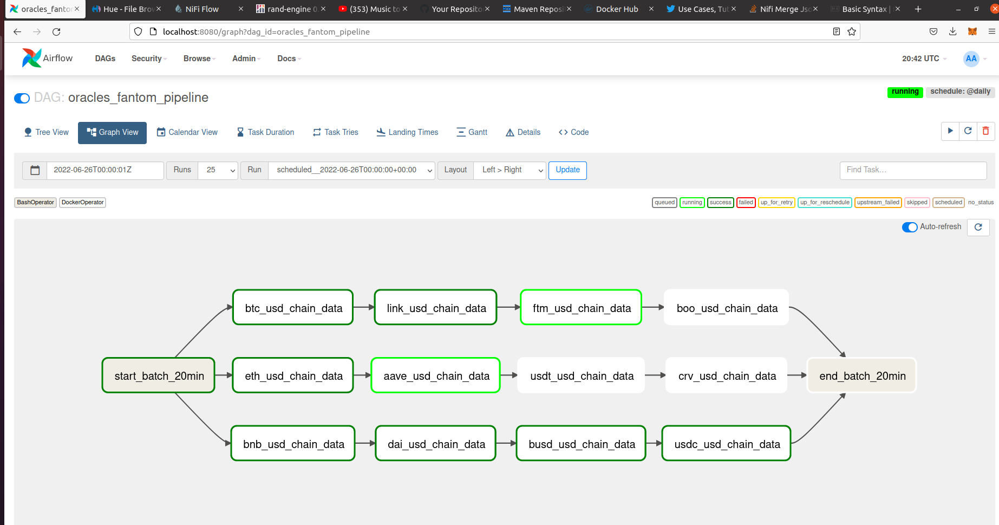

# Case Data Master Santander 5ª Edição

<h1 style="color:darkred">1- Introdução ao Case</h1>

O case contido nesse repositório refere-se a edição 5 do Data Master Santander, para carreira de Engenheiro de dados.

<h2 style="color:darkred">1.1 Enunciado</h2>

Uma empresa decidiu criar seu Data Lake on premisse. Demonstre, com uma prototipação, como você faria a criação do Data Lake com base em uma distribuição Hadoop.
O Data lake deve conter as camadas de arquitetura de dados organizada como preferir.
Entre os cenários de implementação a seguir escolha no mínimo 4 para embarcar no seu protótipo.

* A1- Ingestão de dados do Twitter com hashtag Santander;
* A2- Ingestão de dados públicos estruturados da internet;
* A3- Ingestão de dados de um banco relacional;
* B4- Implementar cenários de mascaramento de dados;
* C1- Demonstrar um consumo analitico via SQL de dados;
* C2- Demonstrar os Pŕos e Contra da habilitação do ACL no HDFS;
* C3- Demonstre Opções para melhorar a performance de consumo de dados do datalake via SQL;
* D1- Demonstrar Schema On e Schema Read On Write;
* D2- Demonstre a importancia da modelagem de dados para o Data lake.

<h1 style="color:darkred">2 - Arquitetura e Serviços utilizados</h1>

A forma escolhida para implementar a solução foi utilizando containers Docker.
No arquivo docker-compose.yml estão listados os serviços utilizados na construção desse projeto

<h1 style="color:darkred">2.1 - Serviços utilizados</h1>

<h3 style="color:red"> Apache Hadoop versão 3.1.1 </h3>

* Imagens docker:
  * **Hadoop Base:** Imagem Docker base para construção de imagens para Resource Manager, Node Manager, Namenode e Datanode
  * **Hadoop Namenode:** Imagem Docker para criar containers Hadoop Namenode.
  * **Hadoop Datanode:** Imagem Docker para criar containers Hadoop Datanode.
  * **Hadoop Node Manager:** Imagem Docker para criar container Hadoop Node Manager.
  * **Hadoop Resource Manager:** Imagem Docker para criar containers Hadoop Resource Manager.

<h3 style="color:red"> Apache HIVE versão 3.1.2 </h3>

* Imagens docker:
  * **Hive Base:** Imagem Docker base para construção de imagens Hive Metastore, Hive Server e Hive Webhcat.
  * **Hive Metastore:** Imagem Docker para criar containers com serviço Hive Metastore.
  * **Hive Server:** Imagem Docker para criar containers com serviço Hive Server.
  * **Hive Webhcat:** Imagem Docker para criar containers com serviço Hive Webhcat.

<h3 style="color:red"> Apache SPARK versão 2.4.5 </h3>

* Imagens docker:
  * **Spark Base:** Imagem Docker base para construção de imagens Spark Master e Spark Worker.
  * **Spark Master:** Imagem Docker para criar containers com serviço Spark Master.
  * **Spark Worker:** Imagem Docker para criar containers com serviço Spark Worker.

<h3 style="color:red"> Apache AIRFLOW versão 2.1.4 </h3>

* Imagens docker:
  * **Postgres:** Imagem Docker posgres para ser usada como banco de dados pelos serviços Airflow e Hive Metastore.
  * **Airflow:** Imagem Docker para criar containers com serviço Airflow.

<h3 style="color:red"> Apache KAFKA (Confluent) versão 7.0.1 </h3>

* Serviços relacionados no arquivo docker-compose.yml:
  * **Kafka Broker 7.0.1:** Serviço de Kafka Broker oferecido pela Confluent.
  * **Control-Center 6.0.1:** Serviço para fornecer uma interface gráfica com Kafka Broker.
  * **Zookeeper:** Serviço Zookeeper para sincronizar serviços em cluster. (Utilizado para o Kafka e para o Nifi)

<h3 style="color:red"> Apache NIFI </h3>

* Imagens docker:
  * **NIFI Latest:** Serviço de Apache NIFI para construção de data flows.

<h3 style="color:red"> HUE versão 4.10.0 </h3>

* Imagens docker:
  * **Hue Base:** Imagem Docker base para construção de containers HUE.

<h3 style="color:red"> Mysql </h3>

* Serviços relacionados no arquivo docker-compose.yml:
  * **MYSQL:** Utilizado para que dados com origem em banco de dados estruturados sejam ingestados no data lake

<h1 style="color:darkred">2.2 - Layout de Serviços - Arquitetura</h1>

No desenho abaixo é possivel ilustrar como os diferentes serviços criados nessa 

<h2 style="color:darkred"> Serviços Rodando</h2>

### Containers com serviços descritos no desenho funcional sendo executados

Os Seviços ativos na figura acima podem ser instanciados com um *git clone* nesse repositório seguido do comando *./start* na pasta raiz do projeto.

  

<h1 style="color:darkred"> 3 - Ingestão de dados no LAKE </h1>

A ingestão de dados no datalake é feita com a ajuda do **Apache NIFI**. este trabalho é feita através do arranjo de processors salvos em templates no diretório */mnt/nifi/flows*. Cada uma das formas de Ingestão de dados no HDFS implementadas nesse trabalho estão detalhadas nos tópicos abaixo. Essas ingestões se baseam nos 3 fluxos de dados a seguir:

* Dados do Twitter -> HDFS
* Banco de dados MYSQL -> HDFS
* Apache KAFKA -> HDFS

<h1 style="color:darkred"> 3.1 - Ingestão de dados do Twitter com hashtag Santander</h1>

Para fazer a ingestão desses dados no Lake foi utilizado o Apache NIFI. Esse serviço tem por funcionalidade criar um dataflow ou seja um fluxo de dados entre companentes. Para esse caso foram utilizados 2 Processors.

<h2 style="color:darkred"> 3.1.1 - Processor GetTwitter</h2>

Traz dados com determinada Hashtag do Twitter. É necessário configurar os parâmetros **Consumer Key, Consumer Secret, Access Token, Acess Token Secret**, obtidas com o cadastro no [Developer Portal do Twitter](https://developer.twitter.com/) e o filtro de dados que se deseja obter **Terms to filter On**.

<h2 style="color:darkred"> 3.1.2 - Processor PutHDFS</h2>

Faz put de dados proveniente do dataflow para o HDFS. É necessário passar o caminho para os arquivos de configuração do HADOOP *core-site.xml e hdfs-site.xml* no parametro **HadoopConfigurations Resources** e o diretório onde os arquivos devem chegar em **Diretório**.

<h2 style="color:darkred"> 3.1.3 - Data Flow do Twitter para o HDFS</h2>

Abaixo é mostrado uma imagem do dataflow em execução, com dados sendo transferidos do Twitter para o HDFS.

Os dados, com origem no Twitter, ingestados atraves no Apache NIFI são mostrados abaixo usando a interface grafica HUE para visualizar o HDFS

<h2 style="color:darkred">3.1.4 - Conclusão para o tópico 3.1</h2>

Como mostrado acima, foi atendido o quesito descrito no **tópico A1**, sendo ingestados para o Data lake dados do twitter com a hashtag Santander.

  

<h1 style="color:darkred"> 3.2 - Ingestão de dados por processos construídos em imagens Docker</h1>

Para as demais formas de aquisição de dados aqui utilizado, a abordagem foi criar imagens docker que podessem reproduzir os processos em qualquer ambiente. E nesse caso em específico serem consumidos por meio do Docker Operator, do Orquestrador de Jobs Airflow.

Foram criadas 3 tipos de imagens:

* [Imagem docker marcoaureliomenezes/batcher](https://hub.docker.com/repository/docker/marcoaureliomenezes/batcher)

* [Imagem docker marcoaureliomenezes/streamers](https://hub.docker.com/repository/docker/marcoaureliomenezes/streamers)

* [Imagem docker marcoaureliomenezes/chainwatcher](https://hub.docker.com/repository/docker/marcoaureliomenezes/chainwatcher)

As imagens docker foram disponibilizadas no dockerhub, de modo a poderesem ser baixadas de qualquer lugar.

<h2 style="color:darkred">3.2.1 - [Rand-Engine] Geração de dados Randômicos em imagens batcher e streamers</h2>

Foi criado por este autor, no objetivo de resolver problemas referentes a massas de dados, um [pacote rand-engine, disponibilizado nesse diretório do github](https://github.com/marcoaureliomenezes/rand_engine)

Esta biblioteca possui o intuito de gerar dados aleatórios de acordo com schemas passados para uma função "create_table", gerando como saída uma tabela para batch ou ou um simples valor, para construção de linhas para uso em mensagens de Streaming. 

Para sua construção foram implementados métodos otimizados em termos e numero de operações e complexidade, buscando aumentar cada vez mais a velocidade na geração desses dados.
dados aleatórios gerados / Tempo.

Esse pacote é de extrema importância na construção de 2 tipos de Jobs utilizados aqui nesse trabalho [e encontra disponivel no repositório de bibliotecas python PyPi.](https://libraries.io/pypi/rand-engine) e pode ser instalado através do comando "pip install rand-engine".

Essa biblioteca foi utilizada nos processos implementados nas imagens **streamers e batcher**. Consulte o repositório Git mencionado acima para saber mais sobre.

<h2 style="color:darkred">3.2.2 - Imagem batcher</h2>

A imagem marcoaureliomenezes/batcher está documentada no repositório
[A imagem marcoaureliomenezes/batcher está documentada neste repositório do github marcoaureliomenezes/dm_batch](https://github.com/marcoaureliomenezes/dm_batch). Lá é possivel consultar mais detalhes sobre a imagem e suas funcionalidades.

* **Download:** *docker pull marcoaureliomenezes/batcher*
* **Funcionalidades:** Possui processos que fazem o download de dados e persistem esses dados em um banco relacional MYSQL. Possui 2 tipos diferentes de processos Batch:
  * **Tipo 1**: Processos que consomem a biblioteca *rand-engine* para criar um schema de dados para conta de clientes e produtos aos quais esses clientes são aderentes. Esses dados são ingestados no banco de dados **rand_engine_data** e posteriormente ingestados no datalake por meio do Apache NIFI.
  * **Tipo 2**: Processos que consomem dados estruturados da API do Yahoo finance para diferentes tipos de ativos com objetivo de ingestá-los no banco mysql e posteriormente no data lake

## pipeline de dados para Batch Inicial
<h3 style="color:darkred">3.2.2.1 - pipeline de dados para Batch Inicial</h3>

<h3 style="color:darkred">3.2.2.2 - Detalhamento de funcionalidades da imagem Batcher</h3>

Essas funcionalidades estão focadas em obter dados estruturados da internet ou gerá-los por meio do pacote *rand-engine* e coloca-los em tabelas no banco de dados MYSQL

<h2 style="color:darkred">3.2.3 - Download de dados estruturados</h2>

Utiliza-se da biblioteca yahoo-finance para fazer o dowload de dados de ativos passados por parâmetro. Esses dados são baixados e colocados em um banco de dados e tabelas passadas por parâmetro aos scripts. Nesse trabalho do Data Master, o airflow utiliza do **Docker Operator** para executar esses scripts, sendo a rótina passada através do parâmetro *entrypoint*.

Os dados baixados correspondem aos campos *Symbol, Date, High, Open, Close*. Eles são correspondentes a parâmetros de valor e negociação para ativos determinados e possuem uma frequência diária. Abaixo são mostradas 2 tabelas SQL formadas, após execução da rotina.

A Imagem Batcher tem por finalidade obter esses dados estruturados, através da biblioteca Yahoo Finance e grava-los em tabelas de um banco MYSQL.

A parte da ingestão dos dados desse banco MYSQL para o HDFS é feita utilizando Processors do NIFI. O conjunto de processors utilizados é mostrado na figura abaixo. A composição e arranjo desses processors é descrita de melhor forma no tópico abaixo, tambem relatando a ingestão dos dados randômicos localizados em tabelas MYSQL para diretórios no Data Lake.

## Dados Ingestados no Data Lake

<h2 style="color:darkred">3.2.4 - Geração de dados estruturados aleatórios</h2>

Utiliza-se da biblioteca rand-engine para definir schemas dowload de dados de ativos passados por parâmetro e gerar dados randomicos. 
Esses dados são baixados e colocados em um banco de dados e tabelas passadas por parâmetro aos scripts. Nesse trabalho do Data Master, o airflow utiliza do **Docker Operator** para executar esses scripts, sendo a rótina passada através do parâmetro *entrypoint*.

Para esse caso é gerada uma massa de dados simulando dados de contas de clientes de um banco. Os clientes possuem os campos *Nome, CPF, Saldo, Agencia e Conta, Renda mensal, Senha, Data de Nascimento e data_entrada*. Eles possuem tambem uma hash_key como id, formada pelos 16 primeiros numeros números hexadecimais do hash256 dos campos *CPF, agencia e conta*. A senha tambem é mascarada usando o algoritmo md5.

Após a geração de dados dos clientes é construída uma tabebela randômica com as colunas hash_key referentes a conta de clientes geradas na primeira parte e com colunas booleanas para determinados produtos que o banco oferece. Isso gera uma distribuição aleatória, com proporções passadas por parâmetro, para aferir os clientes do banco a determinados produtos.

No caso deste trabalho foram criadas tabelas para os produtos **conta corrente, poupança, seguros, consórcio, renda_fixa, renda_variavel, titulos e derivativos. Veja abaixo exemplo desses dados estruturados gerados.

As tabelas de produtos relacionados, formada a partir da tabela de distribuição de *clientes - produto* são mostradas a seguir.

<h3 style="color:darkred">3.2.4.1 - Ingestão no datalake dos dados randômicos</h3>

Os containers executados, tem por função gerar ou obter os dados e escreve-los em tabelas no banco de dados relacional MYSQL. A ingestão de dados do MYSQL para o datalake é feito com o uso do **Apache NIFI**. Para cada tabela é construído uma estrutura de **Processors do NIFI de modo a gerar o dataflow almejado.** O template para esses dataflows pode ser encontrado na pasta */mnt/nifi/flows/rand_engine_mysql_put_hdfs.xml*.

A composição de processors no NIFI para realizar a ingestão de dados de tabelas MYSQL para diretórios do HDFS é formada por:
* **Processor ExecuteSQL:** Permite executar uma query num banco de dados configurado em uma conexão XX e colocar os dados num dataflow
* **Processor ConvertAvroToParquet:** Permite transformar os dados provenientes do Processor anterior que estão no formato AVRO para o formato PARQUET.
* **Processor PutHDFS:** Permite colocar os dados do dataflow em um diretório específico da HDFS.

Para executar queries em bancos mysql com o NIFI, é necessário criar um controlador de serviço (service controller) DBCPConnectionPoll.

Como é necessário um conjunto dos 3 Processors descritos acima para cada tabela, o dataflow para as 9 tabelas geradas a partir de dados aleatórios (para conta de cliente e produtos - cliente), o dataflow completo e os dados ingestados no HDFS pode ser vistos nas 2 figuras figuras abaixo.

<h2 style="color:darkred">3.2.4.1 - Figura abaixo demonstra dados ingestados com origem no MYSQL no Data Lake</h2>

<h2 style="color:darkred">3.2.3 - Conclusão do tópico 3.2</h2>

Dados estruturados foram baixados da internet e ingestados em um banco de dados MYSQL. Posteriormente, esses dados foram ingestados no Lake com a ajuda do **Apache NIFI**. Assim sendo, essa funcionalidade atende aos pontos **A2 e A3**. Para a funcionalidade que ingesta dados gerados de forma randômica para o lake, visto que na composição desses dados há o cenário de mascaramento de dados com ajuda dos algoritmos **SHA256 e MD5** além do ponto **A3 o ponto B3 também foi implantado**.

  

<h2 style="color:darkred">3.3 - Imagem Streamers</h2>

Os Jobs executados nesse trabalho, que utilizam a imagem *streamers* estão associados a geração de dados de operações financeiras. Para o caso em questão **operações de pix, operações com cartão de crédito e geração de boletos.

<h3 style="color:darkred">3.3.1 - Detalhes sobre a imagem Docker Streamers</h3>

A imagem *marcoaureliomenezes/streamers* está documentada no repositório
[A imagem marcoaureliomenezes/batcher está documentada neste repositório do github marcoaureliomenezes/dm_streaming](https://github.com/marcoaureliomenezes/dm_streaming). Lá é possivel consultar mais detalhes sobre a imagem e suas funcionalidades.

* **Download:** *docker pull marcoaureliomenezes/streamers*
* **Funcionalidade:** Gerar dados aleatórios, consumindo métodos da biblioteca *rand-engine*

<h3 style="color:darkred">3.3.2 - Geração de dados aleatórios e ingestão para o Kafka</h3>

Os Jobs de Streaming utilizando a imagem *marcoaureliomenezes/streamers* são acionados também por meio do **Airflow e o Docker Operator.**

Para simular essas operações a biblioteca *rand-engine* é novamente utilizada aqui. Após queries na tabela **cli_accounts gerada no processo Batch anterior** as operações com dados randômicos são atribuidas a um cliente e contraparte.

Os Dados gerados pelo Job tem o seguinte schema:

* **Operações Pix:** Operação, cliente, contraparte, valor, timestamp.
* **Operações Cartão de Crédito:** Operação, cliente, contraparte, tipo, meio, valor, timestamp.
* **Operações Emissão de Boletos:** Operação, cliente, contraparte, valor, data_emissao, data_vencimento, timestamp.

Dados de streaming de emissão de boletos em um tópico do Kafka são apresentados na imagem a seguir.

<h3 style="color:darkred">3.3.3 - Ingestão de dados do Kafka para o Data Lake</h3>

Os dados são ingestados no data lake tambem com o uso do Apach NIFI. Segue abaixo um arranjo de Processors necessário para fazer a ingestão dos dados em Streaming no data Lake.

Como resultado os dados provenientes de streaming chegam no Kafka e são Ingestados para diretórios específicos do HDFS, com o objetovio, por pouco não alcançado de fazer a ingestão Lambda

<h2 style="color:darkred">3.3.4 - Conclusão para tópico 3.3</h2>

Esse tópico quase foi conseguido com maestria para essa edição do Data Master. Ele visava utilizar-se dos métodos de geração de dados aleatórios para construir tabelas com schemas definidos para serem ingestados no Data Lake. Esses dados em batch conversariam com os dados em Streaming. Basta ver a natureza do schema para as tabelas *cli_accounts* e as tabelas *prod_cli*. Com os Jobs de streaming o objetivo era simular operações bancárias tais como *pix, compras no cartão de crédito e em boleto bancário*. Essas operações possuem um valor, uma parte e uma contraparte e como ambas estão presentes na tabela *cli_accounts* seria possivel debitar operações efetuadas no saldo armazenado nas tabelas HIVE, realizando-se assim uma **ingestão Lambda**. Para próxima edição essa funcionalidade estará implementada em sua melhor forma.

<h2 style="color:darkred">3.4 - Imagem Chainwatcher</h2>

A imagem ChainWatcher foi criada com o intuito de interagir com diferentes blockchains e capturar dados de pricefeeds (preço de ativos registrados em contratos inteligentes) por meio de Oracles. Essa forma de aquisição de dados tem altissima disponibilidade, pois esses **pricefeeds são utilizados por contratos inteligentes, o que necessita que tenham uma origem determinística e estejam sempre de pé.**

Para o caso desse repositório, a imagem é consumida para assistir o historico de preços dos ativos mostrados abaixo nos pipelines para as redes **Ethereum, Binance Smart Chain e Fantom.**

A interação com as redes blockchains é feito com ajuda da ferramenta Brownie e o pacote Web3. Os scripts interagem com diferentes contratos, para diferentes ativos e redes para fazer a aquisição dos dados, que então são gravados no Banco de dados estruturado MYSQL. E posteriormente é ingestado no Data lake. **A Aquisição desse histórico de preços gera capacidade analítica sobre os ativos e a possivel identificação de oportunidades para arbitragem e execução de liquidações.**

A imagem *marcoaureliomenezes/chainwatcher* está documentada no repositório
[A imagem marcoaureliomenezes/batcher está documentada neste repositório do github marcoaureliomenezes/dm_streaming](https://github.com/marcoaureliomenezes/chain_watchers). Lá é possivel consultar mais detalhes sobre a imagem e suas funcionalidades e particularidades.

* Download: *docker pull marcoaureliomenezes/chainwatcher*

<h3 style="color:darkred">3.4.1 - Pipelines para aquisição de historico de preços de ativos com base em Oracles</h3>
Segue abaixo os pipelines implementados para as redes blockchain Ethereum, Binance e Fantom.

<h3 style="color:darkred">3.4.1.1 - Pipeline Ethereum Mainnet</h3>
Pipeline para fazer aquisição de dados de Oracles na rede Ethereum.

<h3 style="color:darkred">3.4.1.2 - Pipeline Binance Smart Chain</h3>
Pipeline para fazer aquisição de dados de Oracles na rede Binance.

<h3 style="color:darkred">3.4.1.2 - Pipeline Fantom Chain</h3>
Pipeline para fazer aquisição de dados de Oracles na rede Fantom.

<h2 style="color:darkred">3.4.2 - Dados baixados constantemente para tabelas MYSQL</h2>
A imagem Docker chainwatcher tem por função toda vez que o método get_asset é chamado, para uma rede blockchain em específico, é feita uma consulta no banco de dados para ver se existe uma tabela de determinado par de ativos dessa rede, por exemplo *btc_usd_mainnet* ou *eth_usd_bsc_main*). Caso a tabela não exista é verificado por meio de interações com o smart contract qual é o intervalo de preços (rounds que aquele pricefeed contract possui) que aquele par de assets possui para aquela rede. Então é startado um Job que tem por objetivo escrever uma tabela para todo histórico de preços daquele contrado inteligente pricefeed.
O Job tambem mantém uma tabela de metadados para as tabelas histórico de preços de ativos para controle.

A figura abaixo lustra tabelas de ativos gravados ao longo dos últimos dias

<h1 style="color:darkred">4 - Criação de tabelas hive e ingestão de dados nelas</h2>

